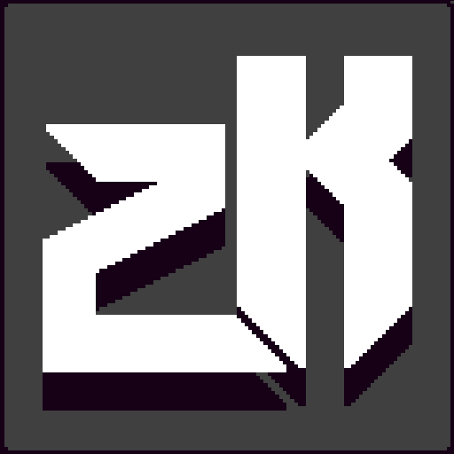

# ZKlash

## Introduction

    

Welcome to ZK-NFT-Clash, a game made during the ethglobal online hackathon, using zero knowledge, and Keynesian beauty contest! In this game, you will compete against other players in a clash of wits and strategy, using your NFTs and zero knowledge proofs to outsmart your opponents and emerge victorious.

Zero knowledge proofs ensure that your moves and strategies remain hidden from prying eyes. And with the Keynesian beauty contest mechanic, you'll need to not only outsmart your opponents, but also predict what they will do and choose the most popular move to win.

### An outlay of the economy and voting results - 

| Action  | Group     | NFT A | NFT B | Winner    | System                           |
|-------|-------|-------|-----------|-----------------------------------|----------------------------------|
| CASE SAME VOTE | GP    | 20    | 10    | GP (20)    | +X Credits    | ZKlash loses    |
|       | GV    | 2    | 0    | GV(2)    | No Change, -ZKlash fee    | NA    |
| CASE DIFFERENT VOTE | GP    | 20    | 10    | GP (20)    | +X Credits    | ZKlash loses    |
|       | GV    | 0    | 2    | GV(2)    | -Y Credits    | ZKlash wins    |
| CASE SAME VOTE | GP    | 20    | 10    | GP (20)    | +X Credits    | ZKlash loses    |
|       | GV    | 1    | 1    | <GV(1), GV(1)>    | +1 Credits, -1 Credits, -ZKlash fee    | NA    |
| CASE DIFFERENT VOTE | GP    | 20    | 10    | GP (20)    | +X Credits    | ZKlash loses    |
|       | GV    | 0    | 2    | GV(2)    | +Y Credits, -Y Credits    | ZKlash wins    |

## Next steps

- [x] Basic Game theme and UI
- [x] Socket backend
- [x] Basic Noir prover
- [x] Basic state contracts
- [ ] Noir usage via JS and integrate with gamemaker
- [ ] Integrated contracts
- [ ] Game mechanics via payments  
- [ ] Integrate 6551
- [ ] Solmate integration

## Training Wheels
1. We will use a backend in the beginning to signal for websockets and also to save state to the chain.
2. The training wheels can come off by allowing it to be a safe module that can write the contract state via AA. The safe can be managed by the community using oSnap from UMA.

## Usage of ERC6551
We intend to use ERC6551 for the following purpose to make the game more easier - 
<To fill after POC works>

